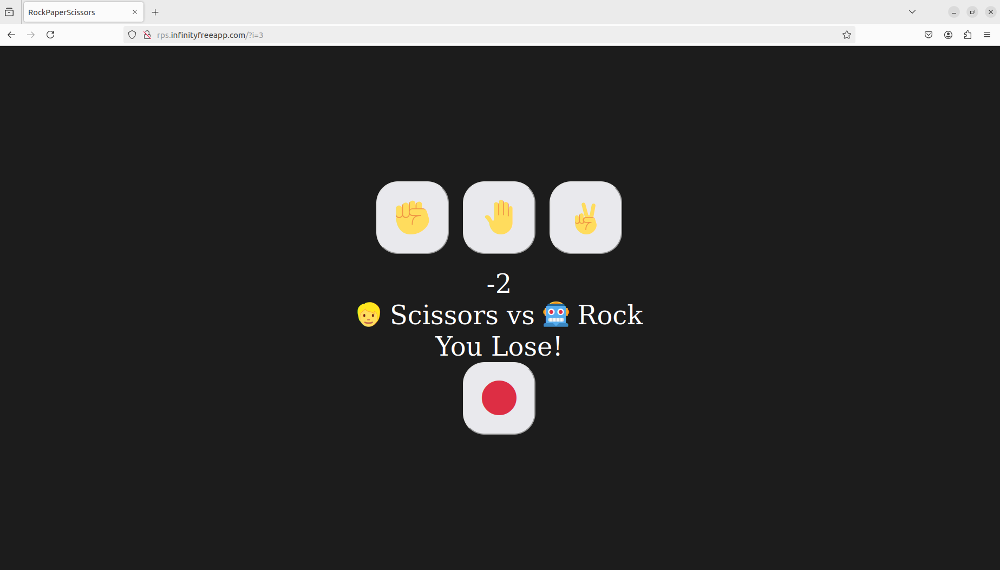

## Description

--> Developed a player vs computer rock-paper-scissors game as a web application using JavaScript, HTML and CSS.

--> The player can choose rock, paper or scissor on each turn. Then the computer will make a choice of its own.

--> Then based upon the player's choice and the computer's choice, the result of that round (win, loss or draw) is displayed immediately by the application.

--> The total score of the game is also maintained and displayed by the application.

--> The total score is reset to zero either by pressing the reset button or by reloading the page.

## UI Snapshots
## Snapshot1

## Snapshot2

## Snapshot3

## Snapshot4

## Snapshot5

